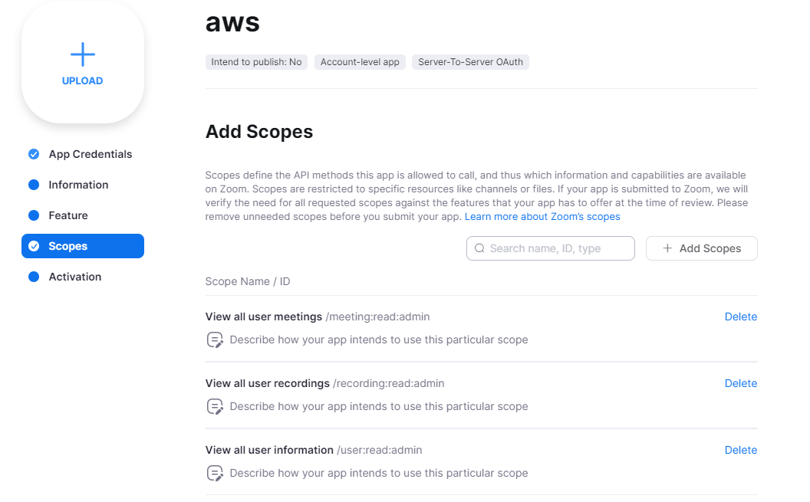

# Migrating Zoom Video Data To AWS


# Description

This project, developed using the Nest framework, facilitates the migration of videos and their associated transcripts from Zoom's API to AWS S3 Buckets. To adhere to Zoom's API protocols, a server-to-server OAuth 2.0 application was created on the Zoom marketplace. A walkthrough for this will be provided in the Setup section. Endpoints have been provided to collect both recording data in monthly (Zoom's interval limit) and weekly intervals, depending on the user preference. The migration process can be distilled into three stages: 
1. User Data Collection: Retrieve or update the 'user' data from Zoom's API, which is necessary for acquiring the recording details.
2. Recording Data Collection: Using the user details from the first step, fetch the recording data for each user via Zoom's recording endpoint.
3. Data Migration: Transfer MP4 files (sized over 10MB) and their corresponding transcripts to AWS S3 Buckets.

# Setup & Installation
### Prerequisites
f you don't have Node.js installed, you'll need it as it's a runtime dependency for the project. Download and install Node.js from the [official website](https://nodejs.org/en).

The project uses nest and and is a dev dependency. Once node is installed you can install nest with this command: 

```
npm install -g @nestjs/cli
```
### 1. Zoom OAuth Application Setup:

Before running any code a server-to-server OAuth application must be set up at  Zoom's [App Marketplace](https://marketplace.zoom.us/). A walkthrough can be found [here](https://developers.zoom.us/docs/internal-apps/create/).

*Note:* When creating the app, be sure to add these scopes to the Zoom OAuth app: 
<p align="center">
  <a href="https://aws.amazon.com/" target="_blank">
          
  </a>
</p>

### 2. Clone the Repository:
```
git clone <https://github.com/mriedeman/zoomOauth-to-aws.git>
cd zoom-to-aws
```

### 3. Environment Configuration:
Navigate to your project's root directory and create a .env file (if it doesn't exist). Add the credentials from the Zoom OAuth application:

```
CLIENT_ID=clientId123
CLIENT_SECRET=clientSecret123
ACCOUNT_ID=accountId123
```

This will allow the application to interact with the Zoom API using the provided credentials.

### 4. Install Project Dependencies
First ensure you are in the correct directory:
```
cd zoom-to-aws
```
Then install the necessary project dependencies:

```
npm install
```

# Running the app
Now we are ready to use the app. Spin up the application in dev mode since this won't be hosted on the internet:

```bash
# watch mode
$ npm run start:dev
```

## Calling Endpoints

### 1. Collect Users Data

#### **Endpoint**
- **Method**: `GET`
- **URL**: `/zoom/update-users`

#### **Description**
This endpoint is used to update users data. It's crucial to call this endpoint first since the data expires every 24 hours.

#### **Usage**

```bash
curl http://localhost:3000/zoom/update-users
```

### 2. Collect Legacy Data Or Weekly Data

***Note:*** Choose either the legacy data or weekly data functions depending on what data you are after. Legacy data collects all data for all users dating back to 2021 and is collected in 1 month intervals. Weekly Data collects the most recent week if no dates are entered, or a specified date range (typically 1 week) for all users.

***Additional Note:***: Data Retrieved from zoom expires every 24 hours, so before calling a collection endpoint, first ensure that the `/zoom/update-users` has been called. Next, ensure any data you choose to migrate has a recording file that has been called within the last 24 hours.
### Legacy Data
#### **Endpoint**
- **Method**: `GET`
- **URL**: `/zoom/collect-legacy-data`

#### **Description**
Gathers historical recording data.

#### **Usage**

```bash
curl http://localhost:3000/zoom/collect-legacy-data
```


### Weekly Data

#### **Endpoint**: 
- **Method**: `GET`
- **URL**: `/zoom/collect-weekly-data`

#### **Description**: 
Fetches data on a weekly basis. If date parameters are not provided, it fetches data for the most recent week. If dates are specified, the data is collected for that specific range.

#### **Usage (Most Recent Week)**:
```bash
curl http://localhost:3000/zoom/collect-weekly-data
```
#### **Usage (Specific Date Range)**:
```
curl "http://localhost:3000/zoom/collect-weekly-data?start_date=YYYY-MM-DD&end_date=YYYY-MM-DD"
```

## 3. Batch Transfer Legacy Data Or Weekly Data

***Note:*** Depending on whether you collected Legacy Data or Weekly Data, use the associated batch transfer endpoint, and specify the same dates you used in the data collection endpoints.

**Endpoint**: GET `/zoom/batch-transfer-legacy-data`

**Description**: Initiates the transfer of historical recording data based on the date range provided.

**Usage**:
```bash
curl "http://localhost:3000/zoom/batch-transfer-legacy-data?start_date=YYYY-MM-DD&end_date=YYYY-MM-DD"
```

### Batch Transfer Weekly Data

**Endpoint**: GET `/zoom/batch-transfer-weekly-data`

**Description**: Initiates the transfer of weekly recording data. If date parameters are not provided, it transfers data for the most recent week. If dates are specified, the data for that specific range is transferred.

**Usage (Most Recent Week)**:
```bash
curl http://localhost:3000/zoom/batch-transfer-weekly-data
```

**Usage (Specific Date Range)**:

```bash
curl "http://localhost:3000/zoom/batch-transfer-weekly-data?start_date=YYYY-MM-DD&end_date=YYYY-MM-DD"
```
